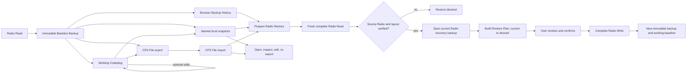
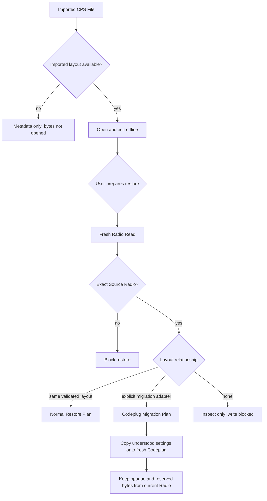

# Codeplug file lifecycle

The CPS treats a saved Codeplug as a durable work item, not merely a byte download. A user can read a Radio, edit or leave it unchanged, export a `.uvl15cps` CPS File, reopen it later without hardware, and restore its desired state only after the Radio is freshly read and verified.

Browser-local Backup History entries can also start this same verified restore flow directly. The user does not need to download and reopen a backup first; selecting Restore on a saved entry performs the fresh Radio Read, source identity check, and Restore Plan preparation before the existing Radio Write confirmation.

The user may also create an explicitly named Working Codeplug copy in
IndexedDB. This is the same integrity-checked CPS File payload stored locally,
not a mutable autosave. Each Save Copy action creates a distinct snapshot;
opening it uses the normal import verifier and retains the original Baseline
Backup, Working Codeplug, Source Radio and layout binding.

## CPS File contents

```text
radio-name-date.uvl15cps
├── manifest.json   format, schema, creation time, layout and Source Radio
├── baseline.bin    exact immutable Codeplug originally read or imported
└── working.bin     desired Codeplug, including edits made before export
```

The manifest records SHA-256 and byte length for both byte artifacts. Import rejects a malformed manifest, missing member, length mismatch, hash mismatch, unsupported schema, or a layout whose decoder is unavailable. The package is portable and integrity-checked, but it is not authenticated and therefore cannot prove which Radio is connected.

## Normal lifecycle



Import never writes a Radio. “Open in CPS” only replaces the browser's active working document. “Prepare restore” performs the fresh read and prepares the reviewable desired state; the existing Radio Write confirmation remains the destructive gate.

## Firmware and layout compatibility

Firmware version is evidence recorded for the user, while the Codeplug layout ID selects a decoder and write policy. Version ordering, matching file size, or a similar model name are not compatibility rules.



For the current release, `uvl15w-3.07.23` is the only available Codeplug layout. A CPS File recorded with that layout can use the normal restore path even when opened later. Future layouts must retain their old decoder for offline opening and add an explicit pairwise migration adapter before cross-layout restore becomes available.

## Old-firmware examples

| Imported file                                              | Current Radio                                     | Result                                                     |
| ---------------------------------------------------------- | ------------------------------------------------- | ---------------------------------------------------------- |
| Different firmware label, explicitly validated same layout | Matching Source Radio                             | Normal restore after fresh read                            |
| Older validated layout, migration adapter exists           | Matching Source Radio with newer validated layout | Migrate understood settings; preserve current opaque bytes |
| Older layout, no adapter                                   | Any Radio                                         | Inspect only; restore blocked                              |
| Raw `.bin` backup                                          | Any Radio                                         | Unbound inspection only; no Radio Write                    |
| `.Fir` Firmware Package                                    | Any Radio                                         | Firmware Update workflow, never Codeplug import            |

## Safety invariants

- Baseline bytes are immutable; edits affect only Working Codeplug bytes.
- Export uses the active Baseline Backup and Working Codeplug, so unedited files retain identical members and edited files retain both states.
- Named local snapshots use the same verified CPS File representation, have
  unique names, and never silently overwrite or autosave the active document.
- The imported Working Codeplug is always the desired restore target.
- Restore always reads first and retains that read as the immediate recovery backup.
- Source Radio identity must match exactly before normal restore.
- Same-layout restore preserves the fresh Radio's opaque, Radio-managed tail at
  `0x20BC0–0x20FFF`. Repeated complete reads showed its 8-byte internal records
  being populated over time without a user Codeplug edit, so the entire tail is
  excluded from the Restore Plan and never copied from an older CPS File.
- Unknown or reserved bytes are never synthesized during migration.
- A file import, compatibility decision, or prepared plan never bypasses the final Radio Write review and confirmation.
